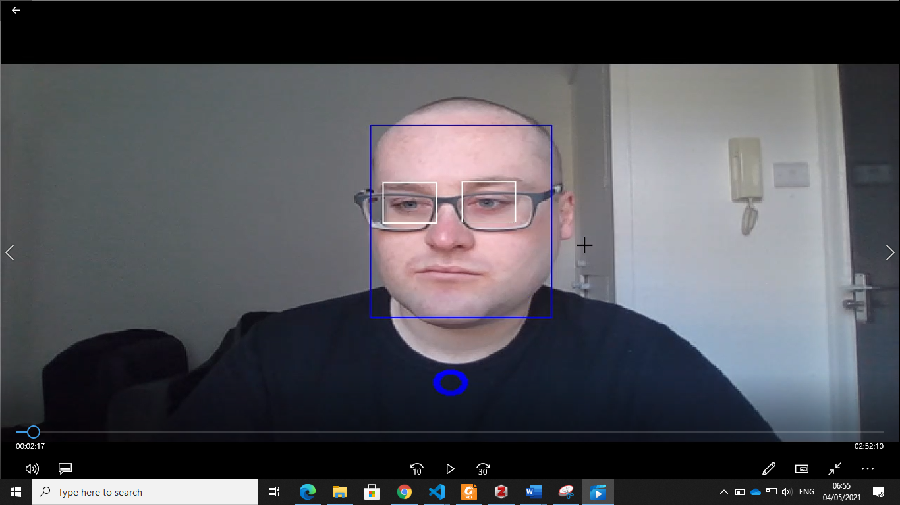
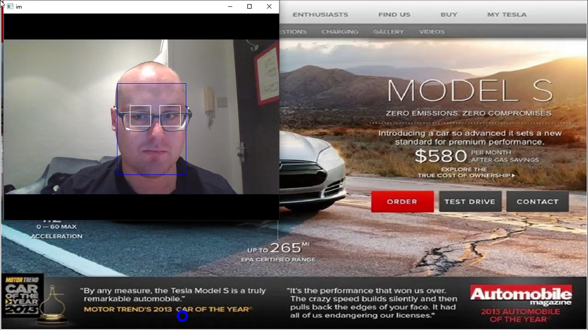
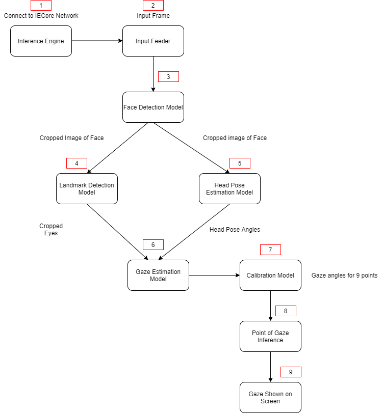
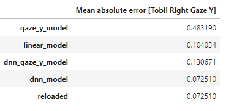
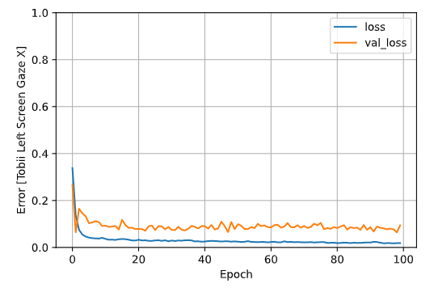

# Webcam-Based Gaze-Tracker #

The objective is to create a webcam-based eye tracker which detects point of gaze for a person sittign at a monitor.
The project uses OpenVINO, a toolkit for inference and neural network optimisation. The project uses four different models.
- [Face Detection](https://docs.openvinotoolkit.org/latest/_models_intel_face_detection_adas_binary_0001_description_face_detection_adas_binary_0001.html)
- [Facial Landmark Detection](https://docs.openvinotoolkit.org/2018_R5/_docs_Retail_object_attributes_landmarks_regression_0009_onnx_desc_landmarks_regression_retail_0009.html)
- [Head Pose Estimation](https://docs.openvinotoolkit.org/latest/omz_models_model_head_pose_estimation_adas_0001.html)
- [Gaze Estimation](https://docs.openvinotoolkit.org/latest/omz_models_model_gaze_estimation_adas_0002.html)

The application outputs a live video feed of where a person is looking at, on their monitor. Here is a demonstration:


Here is a screenshot from a video capture, with gaze overlayed on the webcam feed.


Here is a screenshot from a video capture, with gaze overlayed on the an image.



### The Pipeline

The pipeline is shown as follows:



An in-depth description of these stages can be found over at the [Wiki](https://github.com/healyr4/Gaze-Tracking/wiki/Pipeline-Overview)

## Project Set Up and Installation

### Requirements

#### Hardware

- 6th to 10th generation Intel® Core™ processor with Iris® Pro graphics or Intel® HD Graphics.
- OR use of Intel® Neural Compute Stick 2 (NCS2)
- Webcam (optional)

#### Software

* Intel® Distribution of OpenVINO™ toolkit 2020.3 release
* Python 3.7
* OpenCV 3.4.2
* pyautogui 0.9.48

### Set up development environment

##### 1. Install OpenVINO Toolkit

Dwonlaod OpenVINO. The tutorial is located[here](https://software.intel.com/content/www/us/en/develop/tools/openvino-toolkit/get-started.html).

##### 2. Install dependancies

Use Anaconda to install dependencies. [Anaconda](https://docs.conda.io/en/latest/miniconda.html):

```
conda env create -f environment.yml
```

### Download the models

Use OpenVINO's `model downloader` to download the models. CD into the main directory and run the following commands, depending on your environment

```
#Linux
python3 $INTEL_OPENVINO_DIR/deployment_tools/tools/model_downloader/downloader.py --list model.lst -o models

#Windows
python "%INTEL_OPENVINO_DIR%\deployment_tools\tools\model_downloader\downloader.py" --list model.lst -o models
```

## Demo

Run the application using a video of your choice. Ensure you're in te main directory. The command should be of this format

```
# Windows
python src\main.py -o <folder_to_put_results> -i <video path> -it video --show_input --show_video
For example: python src\main.py -o <my_results> -i <bin/my_video.mp4> -it video --show_input --show_video
```

Using your Webcam:

```
# Windows
python src\main.py  -o results -it cam 
For example:python src\main.py  -o results -it cam  --show_input --show_video
```

The results will be in the directory you specify, in the above example it's my_results

## Command Line Arguments

```
usage: main.py  -it INPUT_TYPE [-i INPUT_PATH]
               [-o OUTPUT_PATH] [-l CPU_EXTENSION] [-d DEVICE] [-r]
               [--show_input] [--show_video] [--record] [calibrate]

optional arguments:
  -it INPUT_TYPE, --input_type INPUT_TYPE
                        Specify 'video', 'image' or 'cam' (to work with
                        camera).
  -i INPUT_PATH, --input_path INPUT_PATH
                        Path to image or video file.
  -o OUTPUT_PATH, --output_path OUTPUT_PATH
                        Path to image or video file.
  -l CPU_EXTENSION, --cpu_extension CPU_EXTENSION
                        MKLDNN (CPU)-targeted custom layers.Absolute path to a
                        shared library with thekernels impl.
  -d DEVICE, --device DEVICE
                        Specify the target device to infer on: CPU, GPU, FPGA
                        or MYRIAD is acceptable. Sample will look for a
                        suitable plugin for device specified (CPU by default)
  -r, --raw_output_message
                        Optional. Output inference results raw values showing
  --show_input          Optional. Show input video
  --show_video          Optional. Show gaze on screen
  --calibrate           Optional. Calibrate for your eyes
  --record              Optional. This was for my own project, getting gaze angles to compare with a Dataset
  
  
```


## Results
Calibration is needed for every user. Gaze angles don't accurately map to on screen-coordinates. This is due to head movement which interfers with the calibration model. I have built a model using a Deep Neural Network to create a model to infer point of gaze. This will be uploaded at a later datewhen it is integrated with the project. 

Here is an example of the Mean Absolute Error obtained using methods such as logistic regression with and without facial landmarks, and a DNN with and without facial landmarks. The mean absolute error was quite low. A video of the calibration stage was used as the training set, and a video of a person performing a task was used as the testing set. The groundtruth was data from a Tobii gaze tracker. This is for a person's right eye, in the y-direction



This is the loss obtained:



## Future Works

- Remove file paths and redundant code from my personal data collection using the eye tracker
- Make an interface for the calibration screen, rather than having to calibrate for each eye and change eye file names
- Alter how the ouput video appears on the screen, it is flakey
- Integrate the deep neural network, calibrate using the 9 point model, plus the DNN, instead of just using interpolation
- Make code more readable

Any questions, feel free to contact me.
